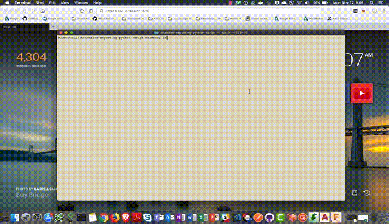

# tokenflex-reporting-python-script

[](https://travis-ci.org/dukedhx/tokenflex-reporting-python-script)
[](http://opensource.org/licenses/MIT)
[](https://www.python.org/dev/peps/pep-0008/)
[](https://www.ietf.org/rfc/rfc5246.txt)
[](https://codebeat.co/projects/github-com-dukedhx-tokenflex-reporting-python-script-master)
[](https://codeclimate.com/github/dukedhx/tokenflex-reporting-python-script/maintainability)
[](https://stackoverflow.com/questions/ask?tags=%5bautodesk-forge)

## Description

A Forge Python script used to download Autodesk TokenFlex usage data. The scripts are designed to communicate with Autodesk and the Forge TokenFlex Reporting API.

### Thumbnail



### Demonstration

See [video demonstration](https://www.youtube.com/watch?v=jXEAHenxZVE)

## Setup

Clone/download this project. We recommended to use [GitHub desktop](https://desktop.github.com). To clone via command line, run the following on Terminal for Mac/Linux or Git Shell for Windows:

```bash
git clone https://github.com/Autodesk-Forge/tokenflex-python-report.script
```

Make sure to have [Python 2.7](https://www.python.org/downloads/release/python-278/) installed.

*Optional: Set up and use [virtualenv](https://virtualenv.pypa.io/en/stable/) to run this sample under isolated dependency environment*

Install dependencies via [pip](https://pip.pypa.io/en/stable/installing/):

```bash
pip install -r requirements.txt
```

### Pre-requisites

For using this sample, you need an Autodesk developer credentials. Visit the [Forge Developer Portal](https://developer.autodesk.com), sign up for an account, then [create an app](https://developer.autodesk.com/myapps/create) with access to **Token Flex Usage Data API**. For this new app, use `http://localhost:3000/api/forge/callback/oauth` as Callback URL. Finally take note of the **Client ID** and **Client Secret**. For localhost testing:

- FORGE\_CLIENT\_ID
- FORGE\_CLIENT\_SECRET
- FORGE\_CALLBACK\_URL

When running the script, you must login with the Autodesk ID of a contract manager or software coordinator to gain access to the contracts' usage data. If you login with a user that does not have such roles, the API will return no data. 

### Running Locally

Linux/Unix:
```bash
chmod u+x start.py # Run once for executive permission
./start.py  --FORGE_CLIENT_ID=YOUR_FORGE_CLIENT_ID --FORGE_CLIENT_SECRET=YOUR_FORGE_CLIENT_SECRET --FORGE_CALLBACK_URL=YOUR_FORGE_CALLBACK_URL
```

Other Platforms:
```
python2.7 start.py --FORGE_CLIENT_ID=YOUR_FORGE_CLIENT_ID --FORGE_CLIENT_SECRET=YOUR_FORGE_CLIENT_SECRET --FORGE_CALLBACK_URL=YOUR_FORGE_CALLBACK_URL
```

If the above runs fine it will start a SimpleHttpServer as your local server and navigate to Autodesk Sign-in in your primary browser. Follow the prompts in the browser to log into your Autodesk account and your local server will receive a callback with an Authorization Token and proceed to download the CSV reports. See Python console output for details.

### Debug Options

Optional environment variables (leave empty for default values):

- FORGE_TOKEN_URL
- FORGE_TOKENFLEX_URL
- FORGE_AUTH_URL

### Deployment

Since we are dealing with Python scripts, there is no deployment needed, simply copy the Python script to your local machine and run the scripts from that location.

### Further Reading

For any questions regarding this sample or the technologies involved, ask a question on [Stack Overflow](https://stackoverflow.com/questions/ask?tags=%5bautodesk-forge,forge-tokenflex) or email to <a href="mailto:forge.help@autodesk.com?subject=Question on Tokenflex&body=Just have a question regarding the tokenflex-reporting-python-script sample: ">Autodesk Forge Developer Advocates</a>.


### Troubleshooting

If running into errors while running the script, on the terminal shell, use the following to confirm the version of Python:

    python --version

Or specify Python version explicitly:

    python2.7 start.py --FORGE_CLIENT_ID=YOUR_FORGE_CLIENT_ID --FORGE_CLIENT_SECRET=YOUR_FORGE_CLIENT_SECRET --FORGE_CALLBACK_URL=YOUR_FORGE_CALLBACK_URL

Starting 2018/10/31, all Forge API endpoints require TLS 1.2 for security reasons, see [here](https://forge.autodesk.com/blog/upcoming-forge-system-upgrade-tls-12-upgrade-date-moved-oct-31) for more details. As such, please [upgrade to Python 2.7.9](https://www.python.org/downloads/release/python-279/) should you run into any TLS related errors/failures like below:
```
InsecurePlatformWarning: A true SSLContext object is not available. This prevents urllib3 from configuring SSL appropriately and may cause certain SSL connections to fail. For more information, see https://urllib3.readthedocs.org/en/latest
```
See  [here](https://support.microsoft.com/en-us/help/3140245/update-to-enable-tls-1-1-and-tls-1-2-as-default-secure-protocols-in-wi) to enable TLS 1.2 on Windows.

### License

This sample is licensed under the terms of the [MIT License](http://opensource.org/licenses/MIT). Please see the [LICENSE](LICENSE) file for full details.


### Authors

Autodesk Premium Support Services

- Bastien Mazeran [@BastienMazeran](https://twitter.com/BastienMazeran)
- Bryan Huang [LinkedIn](https://linkedin.com/in/bryan-huang-1447b862)

See more at [Forge blog](https://forge.autodesk.com/blog).
