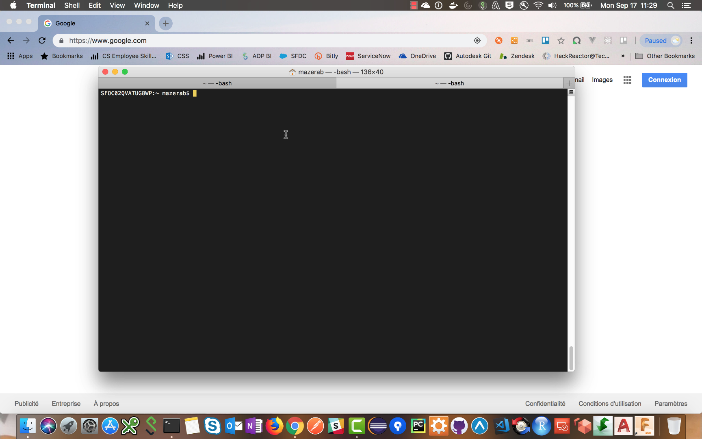

# forge-consumption-reporting-sample

[](https://travis-ci.org/dukedhx/tokenflex-reporting-python-script)
[](http://opensource.org/licenses/MIT)
[](https://www.python.org/dev/peps/pep-0008/)
[](https://codebeat.co/projects/github-com-dukedhx-tokenflex-reporting-python-script-master)
[](https://codeclimate.com/github/dukedhx/tokenflex-reporting-python-script/maintainability)
[](https://gitter.im/autodesk-forge-core)

## Description

A Forge Python script used to download Autodesk consumption data. The scripts are designed to communicate with Autodesk and  the Forge Consumption Reporting API.

### Thumbnail



### Live Version

See [video demonstration](https://www.youtube.com/watch?v=746hxnvlQ1g)

## Setup

Clone/download this project. We recommended to use [GitHub desktop](https://desktop.github.com). To clone via command line, run the following on Terminal for Mac/Linux or Git Shell for Windows:

```bash
git clone https://github.com/mazerab/forge-consumption-reporting-sample
```

Make sure to have [Python 2.7](https://www.python.org/downloads/release/python-278/) installed.

*Optional: Set up and use [virtualenv](https://virtualenv.pypa.io/en/stable/) to run this sample under isolated dependency environment*

Install dependencies via [pip](https://pip.pypa.io/en/stable/installing/):

```bash
pip install -r requirements.txt
```

### Pre-requisites

For using this sample, you need an Autodesk developer credentials. Visit the [Forge Developer Portal](https://developer.autodesk.com), sign up for an account, then [create an app](https://developer.autodesk.com/myapps/create) with access to **Token Flex Usage Data API**. For this new app, use `http://localhost:3000/any/path/takes/your/fancy` as Callback URL. Finally take note of the **Client ID** and **Client Secret**. For localhost testing:

- FORGE\_CLIENT\_ID
- FORGE\_CLIENT\_SECRET
- FORGE\_CALLBACK\_URL

### Running Locally

Linux/Unix:
```bash
chmod u+x start.py # Run once for executive permission
./start.py  --FORGE_CLIENT_ID=YOUR_FORGE_CLIENT_ID --FORGE_CLIENT_SECRET=YOUR_FORGE_CLIENT_SECRET --FORGE_CALLBACK_URL=YOUR_FORGE_CALLBACK_URL
```

Other Platforms:
```
python2.7 start.py --FORGE_CLIENT_ID=YOUR_FORGE_CLIENT_ID --FORGE_CLIENT_SECRET=YOUR_FORGE_CLIENT_SECRET --FORGE_CALLBACK_URL=YOUR_FORGE_CALLBACK_URL
```

If the above runs fine it will start a SimpleHttpServer as your local server and navigate to Autodesk Sign-in in your primary browser. Follow the prompts in the browser to log into your Autodesk account and your local server will receive a callback with an Authorization Token and proceed to download the CSV reports. See Python console output for details.

### Debug Options

Optional environment variables (leave empty for default values):

- FORGE_TOKEN_URL
- FORGE_BASE_URL
- FORGE_TOKENFLEX_URL
- FORGE_AUTH_PATH

### Deployment

Since we are dealing with Python scripts, there is no deployment needed, simply copy the Python script to your local machine and run the scripts from that location.

## Further Reading

### Troubleshooting

If running into errors while running the script, on the terminal shell, use the following to confirm the version of Python:

    python --version

Or specify Python version explicitly:

    python2.7 start.py --FORGE_CLIENT_ID=YOUR_FORGE_CLIENT_ID --FORGE_CLIENT_SECRET=YOUR_FORGE_CLIENT_SECRET --FORGE_CALLBACK_URL=YOUR_FORGE_CALLBACK_URL

### License

This sample is licensed under the terms of the [MIT License](http://opensource.org/licenses/MIT). Please see the [LICENSE](LICENSE) file for full details.


### Authors

Autodesk Premium Support Services

- Bastien Mazeran [@BastienMazeran](https://twitter.com/BastienMazeran)
- Bryan Huang [LinkedIn](https://linkedin.com/in/bryan-huang-1447b862)

See more at [Forge blog](https://forge.autodesk.com/blog).
